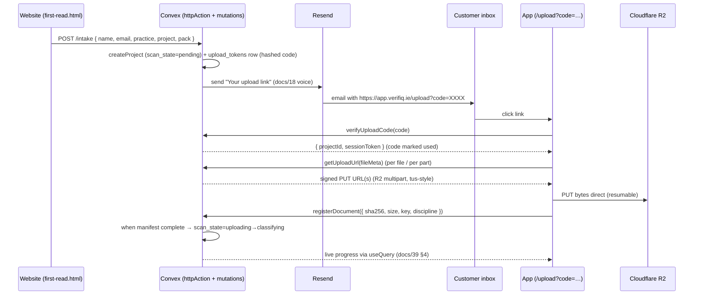

# 42 · Magic-Code Handoff + Direct Upload — Sprint Plan & Requirements

**Doc ID:** `verifiq-magic-direct-v0.1`
**Date:** 2026-06-13
**Owner:** Liam Doolan (founder / solo reviewer)
**Status:** Proposed — pending decisions in §9.
**Companions:** docs/39 (workflow automations), docs/27 (storage stack decision),
docs/18 (Resend email templates), docs/11 (abuse prevention),
`verifiq-prompts/12_mvp_scope.md` (MVP feature #2 + platform mandatory #1).

---

## 1 · Why this exists (the change in one line)

Replace the **email-the-request / email-the-pack concierge** intake with a
**passwordless magic-code handoff** (website issues it → app consumes it) plus
**direct-to-storage resumable upload**, wired across the **website and the app in
tandem**.

### 1.1 Where we are today (grounded in the repo)

| Surface | Today | Evidence |
|---|---|---|
| **Website intake** | Email-driven concierge. The First Read dialog POSTs to an *optional* Formspree endpoint; the default/fallback is `mailto:liam@goviq.ie`. No files move through the system. | `website/first-read.html` (`mailtoFallback`), `website/verifiq-atelier.js` (`mailto:` interceptor), `website/three-products.html` (`Request the brief` mailto links) |
| **App intake** | Stub. `page.tsx` creates a project under a hardcoded `demo@verifiq.ie` user. No auth, no upload UI. Comment: *"Clerk + R2 upload land next."* | `src/app/page.tsx` |
| **Storage spine** | Already built and tus.io-compatible — signed PUT URLs, multipart (>5 MB), abort/cleanup, SHA-256 verify, Convex⇄R2 routing by size. **Unused by any UI.** | `src/storage/r2.ts`, `src/storage/index.ts`, `src/storage/convex.ts` |
| **Data model** | Ready. `documents` (sha256, size, storage_id|r2_key, discipline, status), `scan_state` machine (`pending→uploading→classifying→…`), `jobs`, classifier feedback — all defined. | `src/convex/schema.ts` |
| **Auth** | None wired. `.env.local.example` carries unused **Clerk** keys (to be removed); `users` table has a stub flag + a generic `clerk_user_id` placeholder we will repurpose/rename for the Convex Auth subject. | `.env.local.example`, `schema.ts` `users` |
| **Transactional email** | 5 Resend templates drafted (welcome, scan-complete, …). **No send path wired.** | `docs/18-email-templates.md` |

**Net:** the back-end plumbing for direct upload exists; the *front door*
(authenticated handoff + an upload UI on both surfaces) does not. This sprint
builds the front door and connects it to the existing spine.

### 1.2 What "the more advanced version of magic code" means here

The current "magic" is just a `mailto:` link — a human reads the email and acts.
The advanced version is a **one-time, project-scoped magic code** (a passwordless
email link/code) that:

1. the **website** issues the moment a customer submits the First Read / pilot
   intake form (no human in the loop),
2. lands in the customer's inbox via Resend (docs/18 voice),
3. authenticates them into the **app's** upload session via **Convex Auth**
   (no Clerk, no password) — and
4. is bound to exactly one project + intake, single-use, short-TTL, hashed at
   rest, rate-limited (docs/11 abuse layers).

This is the bridge that lets the customer **upload their pack themselves** instead
of emailing it.

---

## 2 · Goal, success criteria, scope

### 2.1 Goal
A customer goes from "I want a First Read" on the **website** to "my pack is
uploading directly into VerifIQ" in the **app** — passwordless, self-serve, no
email round-trip, no manual file handling.

### 2.2 Definition of done (measurable)
- [ ] A new First Read request on `first-read.html` issues a magic code and sends
      it via Resend — **zero** `mailto:` fallbacks in the happy path.
- [ ] Clicking the code opens the app already scoped to that project, no password.
- [ ] Customer drags a 15 GB multi-file pack in; it uploads **direct to R2**
      (resumable, survives a refresh/network drop), SHA-256 verified per file.
- [ ] On completion the project auto-advances `uploading → classifying` and the
      existing scan pipeline takes over (docs/39 §1).
- [ ] Codes are single-use, expire, are hashed at rest, and are rate-limited.
- [ ] Website and app ship the change together behind one feature flag.

### 2.3 In scope
- Website: intake form → real backend submit (no mailto), "code sent" state, a
  `/upload?code=…` entry that deep-links into the app.
- Backend (Convex): magic-code issue/verify mutations + actions, upload-session
  binding, Resend send path, abuse controls, audit-log entries.
- App: code-verify route, authenticated upload session, **resumable direct
  upload UI** (per-discipline gate), manifest + progress, auto-advance to classify.
- One feature flag covering both surfaces; rollback plan.

### 2.4 Out of scope (this sprint)
- Full account system / password login. Auth is **Convex Auth** with the
  magic-link (email OTP) provider; the project-scoped upload code rides on top.
- Per-discipline ZIP gating beyond a simple discipline selector (MVP feature #2
  full version → Phase 2).
- Billing / Stripe checkout (the `VERIFIQ_FIRST_READ_URL` Stripe path stays as-is).
- Mobile app, multi-region, SSO. (`12_mvp_scope.md` "explicitly NOT in MVP".)

---

## 3 · Target architecture — the handoff



**Key properties**
- The website never holds bytes; files go **browser → R2** via signed URLs from
  the existing `R2Storage` provider (`src/storage/r2.ts`).
- Auth is **Convex Auth** (`@convex-dev/auth`) using its email magic-link / OTP
  provider — the email Resend already sends *is* the Convex Auth sign-in. On
  verify, Convex Auth establishes the identity and we mint a short-lived
  **upload session** bound to exactly one project. No Clerk, no third-party IdP.
- Every step writes `audit_log` (issue, verify, upload, advance) — the
  non-negotiable trust artefact (docs/39 §2).

---

## 4 · New / changed data model

Additive only — no existing table is reshaped (CLAUDE.md schema-lock rule).

```ts
// upload_tokens — the magic code. Code is stored HASHED (sha256), never raw.
upload_tokens: defineTable({
  project_id: v.id("projects"),
  email: v.string(),                 // intake email (lowercased)
  code_hash: v.string(),             // sha256(code + server pepper)
  purpose: v.union(v.literal("first_read"), v.literal("pilot_upload")),
  status: v.union(
    v.literal("issued"), v.literal("used"), v.literal("expired"), v.literal("revoked"),
  ),
  attempts: v.number(),              // verify attempts (rate-limit / lockout)
  expires_at: v.number(),            // e.g. now + 72h
  used_at: v.optional(v.number()),
  created_at: v.number(),
})
  .index("by_code_hash", ["code_hash"])
  .index("by_project", ["project_id"])
  .index("by_email", ["email"]),

// upload_sessions — a verified, project-scoped session minted on code verify.
upload_sessions: defineTable({
  project_id: v.id("projects"),
  token_id: v.id("upload_tokens"),
  session_hash: v.string(),          // sha256 of the bearer session token
  expires_at: v.number(),            // short, e.g. now + 4h, refreshable while uploading
  created_at: v.number(),
})
  .index("by_session_hash", ["session_hash"])
  .index("by_project", ["project_id"]),
```

`documents`, `scan_state`, `jobs` are unchanged — the upload session writes into
them through ownership-checked mutations.

---

## 5 · Requirements

### 5.1 Functional — Website (Track W)
- **W1** First Read / pilot intake form submits to a real Convex `httpAction`
  endpoint (JSON), not Formspree/mailto. `mailto` demoted to a *degraded*
  fallback only if the endpoint is unreachable.
- **W2** On success the form shows a "Check your inbox — we've sent your secure
  upload link" state (replaces today's `showDone()`), with resend-after-60s.
- **W3** All "Request the brief" CTAs (`three-products.html`, atelier interceptor)
  route to the same intake endpoint, not `mailto:liam@goviq.ie`.
- **W4** Honeypot + basic client validation; never expose whether an email exists.
- **W5** Static-site friendly: endpoint base URL injected via the existing
  `window.VERIFIQ_*` config pattern (`first-read.html`), feature-flagged.

### 5.2 Functional — App (Track A)
- **A1** Route `/upload?code=…` (and `/upload` for manual entry) verifies the code
  via Convex, mints a session, and loads the bound project.
- **A2** Invalid/expired/used code → clear, non-leaky error + "request a new link".
- **A3** **Direct resumable upload UI**: drag-drop multi-file, per-file progress,
  pause/resume, survives refresh (resume via R2 multipart `uploadId` + part ETags
  already in `r2.ts`). Target: 15 GB pack, hundreds of files (docs/08 scope).
- **A4** Per-file: client SHA-256 → `registerDocument` → server verify
  (`R2Storage.verifyUpload`) → mark `documents.status=uploaded`.
- **A5** A lightweight **discipline selector** per file/batch (MVP-level of
  feature #2; full ZIP-gate is Phase 2). Default to classifier if skipped.
- **A6** "I'm done" → manifest sealed → `scan_state: uploading → classifying`;
  the existing council pipeline runs (docs/39). Live findings via `useQuery`.
- **A7** Session expiry mid-upload auto-refreshes while the tab is active; a
  resumed link re-verifies without re-issuing a code.

### 5.3 Functional — Shared backend (Track B)
- **B1** `intake` httpAction: validate → `createProject(pending)` → issue token →
  Resend send → audit. Idempotent on (email, open token) to avoid duplicate codes.
- **B2** `issueUploadCode` / `verifyUploadCode` / `mintSession` / `revokeToken`
  mutations+actions; code generation = 32+ bits entropy, human-typeable.
- **B3** Resend integration (env `RESEND_API_KEY`, `EMAIL_FROM`) using a new
  docs/18 template "Your secure upload link".
- **B4** `getUploadUrl` / multipart endpoints become **session-authenticated**
  (today they're provider methods with no caller auth) — every call checks the
  session→project binding before signing.
- **B5** Auto-advance trigger: when last expected document flips to `uploaded`,
  transition `scan_state` and enqueue classify jobs (reuse existing orchestrator).

### 5.4 Non-functional
- **N1 Security/abuse (docs/11):** codes hashed + peppered at rest; single-use;
  ≤5 verify attempts then lockout; per-IP and per-email rate limits on issue &
  verify; signed URLs short-TTL (already 1h in `r2.ts`); no enumeration leak.
- **N2 Data residency:** R2 EU bucket only (`R2_BUCKET_NAME=verifiq-prod-eu-west`),
  Resend EU — consistent with docs/27 / docs/20 GDPR posture.
- **N3 Auditability:** issue / send / verify / upload / advance each write
  `audit_log` (mutations, never actions — docs/39 §2).
- **N4 Resilience:** upload survives refresh + single network drop; partial
  multipart uploads cleaned up via `abortMultipartUpload` on cancel/expiry.
- **N5 Observability:** Sentry breadcrumbs on issue/verify/upload failures;
  counters for codes issued/verified/expired (platform mandatory #6).
- **N6 Privacy:** intake collects only docs/18 fields; email lowercased; tokens
  purged after `expires_at + 30d`.

### 5.5 Acceptance tests (the regression gate)
- Convex unit tests (`convex-test`): issue→verify→mint happy path; expired code;
  reused code; >5 attempts lockout; duplicate-intake idempotency; session→project
  ownership enforced on `getUploadUrl`.
- Storage tests: multipart create→part→complete→verify; abort cleanup;
  sha256 mismatch path (extend existing `r2.ts` coverage).
- Playwright (docs/36): website submit → "check inbox"; `/upload?code` →
  upload 3 files → auto-advance to `classifying` (mock Resend + R2). One end-to-end
  spec added to the CI validation pack (platform mandatory #7).

---

## 6 · Sprint plan (2 sprints · ~4 weeks · solo + Claude Code)

Tracks W (website), A (app), B (backend) run in parallel; B unblocks W and A.
Estimates are ideal-days for a solo founder pairing with Claude Code.

### Sprint 0 — Spike & decisions (2 days, before Sprint 1)
- S0.1 Install + bootstrap **Convex Auth** (`@convex-dev/auth`) with the email
      magic-link/OTP provider wired to Resend; confirm a sign-in round-trip on a
      throwaway page. Remove Clerk env vars.
- S0.2 Spike: confirm R2 multipart resume from a real 2 GB browser upload on the
      existing `r2.ts` (de-risks A3 — the single biggest unknown).
- S0.3 Provision Resend EU + verify sending domain; add env keys.

### Sprint 1 — "Issue → verify → empty session" (Weeks 1–2)
| ID | Track | Story | Est | Acceptance |
|---|---|---|---|---|
| 1.0 | B | **Convex Auth** config (`auth.ts`, providers, ConvexAuthProvider in app), email OTP via Resend | 1.5d | sign-in round-trip green |
| 1.1 | B | `upload_tokens` + `upload_sessions` schema + mutations (issue/verify/mint/revoke), hashing+pepper, layered on the Convex Auth identity | 2d | unit tests in §5.5 green |
| 1.2 | B | `intake` httpAction: createProject + issue + audit + idempotency | 1.5d | duplicate intake → one code |
| 1.3 | B | Resend send path + "secure upload link" template (docs/18) | 1d | email rendered in test harness |
| 1.4 | W | First Read form → intake endpoint; "check inbox" state; resend-60s | 1.5d | no mailto in happy path |
| 1.5 | W | Re-point all "Request the brief" CTAs to intake endpoint | 0.5d | mailto only on endpoint failure |
| 1.6 | A | `/upload?code` route: verify → mint session → load project shell | 1.5d | invalid/expired/used handled (A2) |
| 1.7 | B/A | Abuse controls: rate limits, attempt lockout, no enumeration | 1d | lockout + limit tests green |
| 1.8 | — | Feature flag wiring (both surfaces) + audit-log assertions | 0.5d | flag off = current behaviour |

**Sprint 1 demo:** submit on the website → receive code → open app scoped to the
new project (empty upload screen). No files yet.

### Sprint 2 — "Direct upload → classify" (Weeks 3–4)
| ID | Track | Story | Est | Acceptance |
|---|---|---|---|---|
| 2.1 | B | Session-auth wrapper on `getUploadUrl`/multipart (B4) | 1d | unauthorised call rejected |
| 2.2 | A | Resumable upload UI: drag-drop, multi-file, per-file progress | 2.5d | 15 GB / many files (A3) |
| 2.3 | A | Client SHA-256 + `registerDocument` + server verify | 1d | mismatch → re-upload (A4) |
| 2.4 | A | Refresh/network-drop resume via multipart uploadId+ETags | 1.5d | refresh mid-upload resumes |
| 2.5 | A | Discipline selector (MVP-level) + manifest view | 1d | files tagged or defaulted (A5) |
| 2.6 | B | Auto-advance `uploading→classifying` + enqueue classify | 1d | pipeline runs (docs/39 §1) |
| 2.7 | A | Live progress + handoff to existing findings view (useQuery) | 1d | register fills in live |
| 2.8 | — | Playwright e2e in CI validation pack; abort/cleanup on cancel | 1.5d | §5.5 e2e green |
| 2.9 | — | Flag rollout plan + runbook + rollback | 0.5d | documented; staged enable |

**Sprint 2 demo:** end-to-end — website request → email link → app upload of a
real pack → direct to R2 → auto-classify → live findings.

---

## 7 · Work breakdown by file (where it lands)

| Area | Files touched / added |
|---|---|
| Schema | `src/convex/schema.ts` (+`upload_tokens`, `upload_sessions`) |
| Magic code | `src/convex/uploadTokens.ts` (new), `src/convex/http.ts` (new httpAction) |
| Email | `src/convex/email.ts` (new, Resend), `docs/18-email-templates.md` (+template 6) |
| Storage auth | `src/storage/index.ts`, `src/convex/mutations.ts` (session checks) |
| App routes/UI | `src/app/upload/page.tsx` (new), upload client lib `src/app/_lib/upload.ts` (new) |
| Auto-advance | `src/convex/workflow.ts` / `reviewData.ts` (transition trigger) |
| Website | `website/first-read.html`, `website/three-products.html`, `website/verifiq-atelier.js` |
| Tests | `tests/uploadTokens.test.ts`, `tests/upload-e2e.spec.ts`, extend `r2` tests |
| Auth | `@convex-dev/auth` install; `src/convex/auth.ts` (new) + `auth.config.ts`; `src/app/providers.tsx` (ConvexAuthProvider) |
| Config | `.env.local.example` (**remove** Clerk keys; **add** `RESEND_API_KEY`, `EMAIL_FROM`, `UPLOAD_TOKEN_PEPPER`, `APP_BASE_URL`, Convex Auth `SITE_URL` + `JWT_PRIVATE_KEY`/`JWKS`) |

---

## 8 · Risks & mitigations

| Risk | Impact | Mitigation |
|---|---|---|
| R2 multipart resume harder than spec in-browser | A3/A4 slip | Sprint 0 spike (S0.2) before committing Sprint 2 |
| Static website can't call Convex cleanly (CORS) | W1 blocked | Convex `httpAction` with CORS; fallback mailto kept behind flag |
| Magic codes phished/forwarded | account takeover-lite | single-use, short TTL, bind to project only (not billing), audit every verify |
| Deliverability (codes in spam) | drop-off | Resend EU verified domain (S0.3); show code on-screen as backup |
| Pilot doesn't want passwordless | adoption | code is additive; Convex Auth supports adding a password provider later without re-platforming |
| Scope creep into full ZIP-gate / Clerk | timeline | explicitly Phase 2 (§2.4) |

---

## 9 · Decisions needed (blocking Sprint 0)

- **D1 — Auth model. DECIDED: Convex Auth** (`@convex-dev/auth`) with the email
  magic-link / OTP provider. No Clerk. The Clerk env vars in `.env.local.example`
  get removed and replaced with Convex Auth config. Open sub-decision: use Convex
  Auth's built-in OTP email provider with Resend, or our own `upload_tokens` code
  layered on a Convex Auth session — *recommendation: Convex Auth issues the
  sign-in; `upload_tokens` scopes it to one project/pack.*
- **D2 — Is there an existing "advanced magic code" to port?** If another
  GovIQ/VerifIQ repo already has this, Track B becomes port-not-build. Confirm.
- **D3 — Domain.** Upload links point at `app.verifiq.ie` (needs DNS + deploy) vs
  a Convex-hosted route for the pilot. *Recommendation: `app.verifiq.ie`.*
- **D4 — Code format.** 6-char on-screen code **and** a one-click link, or
  link-only. *Recommendation: both (link + code as fallback for spam).*
- **D5 — Keep `mailto` as degraded fallback** behind the flag, or remove
  entirely? *Recommendation: keep as failure-only fallback for Sprint 1, remove
  in Sprint 2 cleanup.*

---

## 10 · Out-of-scope follow-ups (Phase 2 backlog)
- Convex Auth password/social providers + returning-customer dashboard.
- Per-discipline ZIP gate + manifest reconciliation (MVP feature #2 complete).
- Stripe checkout merged into the same handoff (issue code post-payment).
- Webhook/Resend notifications on classify-confirm + release (docs/39 §5).
